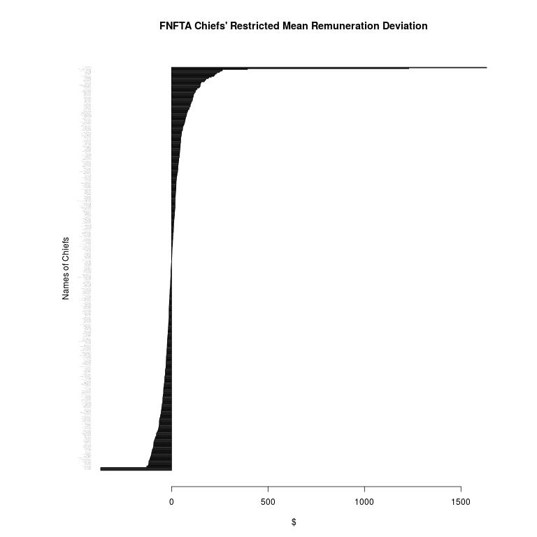
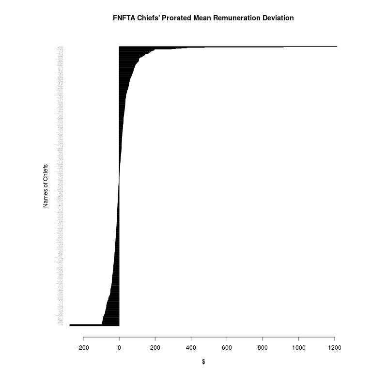
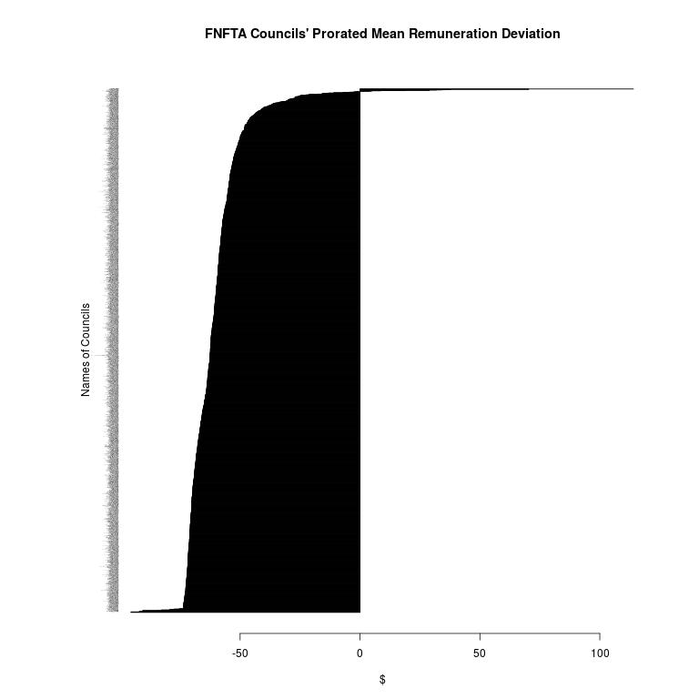
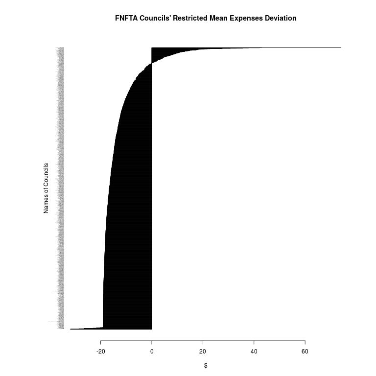
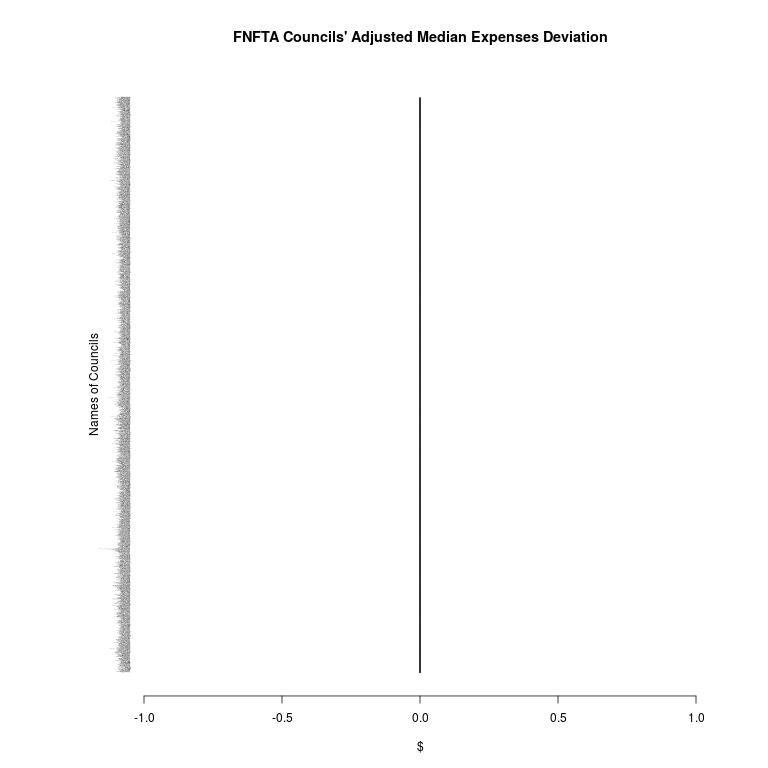

# Data Analysis

<table>
 <tr>
  <td></td>
  <td></td>
  <td>Number of</td>
  <td>Median</td>
  <td>Mean</td>
  <td>zero Median</td>
  <td>zero Mean</td>
  <td>first zero</td>
 </tr>
 <tr>
  <td>Remuneration</td>
  <td>restricted</td>
  <td>473</td>
  <td>$65,780</td>
  <td>$72,685</td>
  <td>$64,420</td>
  <td>$64,446</td>
  <td>29</td>
 </tr>
 <tr>
  <td></td>
  <td>prorated</td>
  <td>554</td>
  <td>$65,518</td>
  <td>$73,017</td>
  <td>$64,031</td>
  <td>$64,104</td>
  <td>42</td>
 </tr>
 <tr>
  <td></td>
  <td>adjusted</td>
  <td>554</td>
  <td>$66,054</td>
  <td>$72,841</td>
  <td>$64,400</td>
  <td>$64,448</td>
  <td>37</td>
 </tr>
 <tr>
  <td>Expenses</td>
  <td>restricted</td>
  <td>$14,969</td>
  <td>$22,003</td>
  <td>$3,995</td>
  <td>$4,003</td>
  <td>338</td>
 </tr>
 <tr>
  <td></td>
  <td>prorated</td>
  <td>$14,603</td>
  <td>$21,597</td>
  <td>$2,489</td>
  <td>$2,497</td>
  <td>512</td>
 </tr>
 <tr>
  <td></td>
  <td>adjusted</td>
  <td>$14,757</td>
  <td>$21,693</td>
  <td>$3,553</td>
  <td>$3,573</td>
  <td>416</td>
 </tr>
</table>

+ r-chief\_xor\_council
+ r-restrict\_prorate\_adjust
+ generic-analysis
+ chief-analysis
+ council-analysis

### Intuition:
### Dependencies:
### Limitations:
### Recommendation:

r-chief\_xor\_council:

+ data\_structure-consolidated-15-03-06-0221.csv
+ skim\_chief\_xor\_council.r
+ chiefs\_grep.log
+ chiefs\_except.log
+ chiefs\_let.log
+ council\_grep.log
+ council\_except.log
+ council\_let.log
+ skim\_remainder.r
+ remainder.log
+ partition\_chief\_and\_council.r

### Intuition:
### Dependencies:
### Limitations:
### Recommendation:

r-restrict\_prorate\_adjust:

+ data\_structure-chiefs-15-03-06-0405.csv
+ data\_structure-council-15-03-06-0405.csv
+ restrict.r
+ prorate.r
+ adjust.r

### Intuition:
### Dependencies:
### Limitations:
### Recommendation:

generic-analysis:

generic.r

### Intuition:
### Dependencies:
### Limitations:
### Recommendation:

chief-analysis:

+ data\_structure-restricted-chiefs.csv
+ data\_structure-prorated-chiefs.csv
+ data\_structure-adjusted-chiefs.csv
+ source.r
+ analyze
+ stats.log

### Intuition:
### Dependencies:
### Limitations:
### Recommendation:

council-analysis:

+ data\_structure-restricted-council.csv
+ data\_structure-prorated-council.csv
+ data\_structure-adjusted-council.csv
+ source.r
+ analyze
+ stats.log

## Conclusion:

The more I look at how much non-council financial information is required to be posted, the more I think the intent
is for the feds to use this information to size up their opponent: Legal battle with a First Nation? Legal and political
strategy is determined by knowing how much infrastructure and resources they have; what connections (networks, social support)
they have to obtain additional funding for their legal battles, etc.

Like the NSA "it's just metadata" argument, you can determine a surprising amount with even this "meta" information
(and it's not even that meta).

