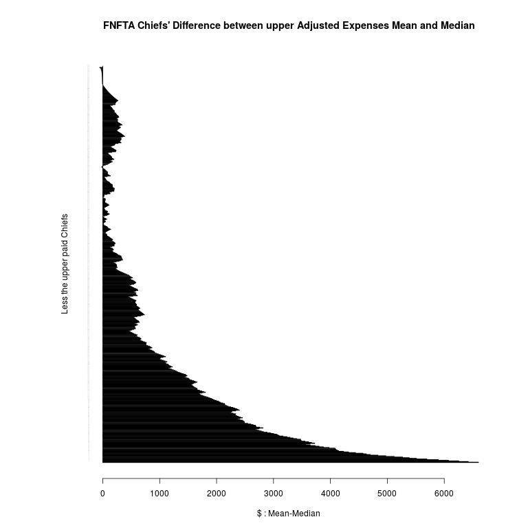

# Data Analysis

Let's get straight to the results as that is what everyone is interested in:

## Chiefs:

<table>
 <tr>
  <td>Chiefs</td>
  <td></td>
  <td>Number of</td>
  <td>Median</td>
  <td>Mean</td>
  <td>first zero</td>
  <td>zero Median</td>
  <td>zero Mean</td>
 </tr>
 <tr>
  <td>Remuneration</td>
  <td>restricted</td>
  <td>473</td>
  <td>$65,780</td>
  <td>$72,685</td>
  <td>29</td>
  <td>$64,420</td>
  <td>$64,446</td>
 </tr>
 <tr>
  <td></td>
  <td>prorated</td>
  <td>554</td>
  <td>$65,518</td>
  <td>$73,017</td>
  <td>42</td>
  <td>$64,031</td>
  <td>$64,104</td>
 </tr>
 <tr>
  <td></td>
  <td>adjusted</td>
  <td>554</td>
  <td>$66,054</td>
  <td>$72,841</td>
  <td>37</td>
  <td>$64,400</td>
  <td>$64,448</td>
 </tr>
 <tr>
  <td>Expenses</td>
  <td>restricted</td>
  <td>473</td>
  <td>$14,969</td>
  <td>$22,003</td>
  <td>338</td>
  <td>$3,995</td>
  <td>$4,003</td>
 </tr>
 <tr>
  <td></td>
  <td>prorated</td>
  <td>554</td>
  <td>$14,603</td>
  <td>$21,597</td>
  <td>512</td>
  <td>$2,489</td>
  <td>$2,497</td>
 </tr>
 <tr>
  <td></td>
  <td>adjusted</td>
  <td>554</td>
  <td>$14,757</td>
  <td>$21,693</td>
  <td>416</td>
  <td>$3,553</td>
  <td>$3,573</td>
 </tr>
</table>

How to read this table? Here goes:

As stated in the upperleft corner, this table of statistics is in regard to First Nations' *Chiefs*. These stats are primarily
split into "Remuneration" and "Expenses".  Using *Remuneration* as example, we now have three interpretations originally
taken from the cleaned and consolidated data that was generated from the translation phase of this project. Each interpretation
varies based on the problematic natures of concepts like *time* and *comparison*.  If some chiefs did not work the full year
(election year), how do you compare their salaries to obtain an average?  The problem---as well as need for more than one
interpretation---arises specifically within the *Months* header from the consolidated data table.

Of the three interpretations, "restricted" takes any Chiefs who did *not* work the full year and simply removes their data.
We're interested in "12 months" data, so anything else which isn't directly *comparable* is simply purged. These deletions
inform the header "Number of" within the above table, which in this case says the restricted statistics are based off of 473
chiefs (instead of the 559 in which the consolidated data is based).

The "prorated" interpretation takes any Chief who didn't work the 12 months, and converts their remuneration and expenses
to what they would have made if they did work a full 12 months. It thus makes all the data comparable; due to a few
exceptions the data is taken from 554 chiefs (instead of the 559).

The "adjusted" interpretation extends the prorated strategy, and is the one I consider **most accurate**. The need to
improve upon the prorated table comes from "double counting": Those Nations which *did* have election years---and thus had
more than one chief on record---would have *all* chiefs remunerations and expenses of a single Nation contribute to these
statistics. The adjusted version algorithmically takes the Chief who worked the longest for that year (even if it happened
this was an outgoing chief; the algorithm didn't discern such details), and drops any other chief of that nation---this
way at most one chief per nation is counted.  Finally, these adjusted chiefs remuneration and expenses are prorated,
and the statistics are then taken from this data.

----------------------

With the interpretations outlined, I will talk briefly about the remaining columns. The "Median" and "Mean" are pretty
straightforward, but the "zero Median" and "zero Mean" need some explaining. The idea is, if you were to remove the top
paid chief, how would that effect the resulting median and mean? Furthermore, if you kept removing top paid chiefs in this
manner, *how many* would you need to remove until the median and mean were effectively equal? This is signified by the
"first zero" column in the above table. Under the adjusted remuneration for example, you'd need to remove the first **37**
top paid chiefs in order for the median and mean to match (or nearly match). The "zero Median" and "zero Mean" then give
this median and mean pair where the "first zero" number of chiefs removed.

Finally, why would such a "first zero" analysis matter?

> I will emphasize here *I am not a polished statistician*. I would consider myself a competent entry level statistician,
> but part of this project is *personal* in that it allows me to explore and develop the necessary intuitions to take my
> statistal education and skill set further. 

The "first zero" analysis is intuitively relevant as I'm told the difference between *median* and *mean* can indicate or at
least hint at wealth distribution within a population (or society). This makes sense, for if you have one-hundred people
making $30,000 USD you will get both a mean and median of $30,000, but as soon as you add a single person, say Warren Buffett's
earnings into the mix (as the classic economics example goes) all of a sudden the median is still at $30,000 but the mean has
just shot up. In society in general, if there is a large middle class economically speaking, then far less of the population
will be bottom and top earners---meaning their salaries will have less effect on the mean. When this is the case, mean and
median tend to be closer. If for example the middle class is small, or the top earners make greatly disproportionate quantities
relative to the middle class, then those top earner's salaries will skew the mean to be much higher than the median.

In this case, the data---at least to me---suggests that 37 out of 554 (~ 7%) of Chiefs make disproportionate amounts relative
to other chiefs (such that they skew a difference between the median and mean). If this intuition is even appropriate, what does
one even do with this information? Keep in mind chiefs' salaries are determined not in relation to each other, but in relation
to their own nations---and each nation as a **self-determining society** with its own contextual factors shapes that relationship,
notably here, its financial relationship.

As this is the case, I don't believe it's fair to compare chiefs' earnings with respect to each other (they do not make up any
societies that I know of), but rather it provides an indicator of the economic health of nations themselves, and especially
relative to each other. In this case, my own interpretation is that there is a bit of a spread of wealth distribution across
the First Nations:

> My own opinion is that if we are going to rise, we are best to do it together,
> and when possible (when it doesn't conflict with individual nations' sovereignty),
> that the various First Nations pull and pool resources and be each others' insurances:
> Share expertise, and help build each other up. One of First Nations' greatest
> strengths against colonial powers is the fact that they are *not* united,
> meaning the federal government has to deal with 500+ nations separately.
> Regardless, providing support networks that do not compromise this strength
> is easily possible, and it also means the federal government is less able
> to isolate, divide, and conquer.

# Council:

The table structure for council is almost identical and does not need its own "how to read this" explanation with two exceptions.
First is the "average size" column: This column provides the average number of council members across nations (excluding chiefs).
So for example the "adjusted" interpretation has about 6 (~ 5.58) councillors per nation, taken from 551 nations, which as a
back-of-the-envelope calculation means there's about 3075 councillors on record for the year. The second note is that once again,
the "adjusted" interpretation I view to be most accurate, but the algorithm is slightly different as it's expected there be more
than one Councillor. The algorithm---lacking in perfect accuracy it should be noted, but is still likely the most accurate of the
three interpretations---looks at each nation one at a time, pulls out councillors who worked the full year, and takes only half
of the remaining councillors; of those half, it takes those who worked the longest within the year, it does not discern if they
were outgoing councillors. It does this to remove double counting, and so its "average size" of the three interpretations
is likely most accurate.

<table>
 <tr>
  <td>Council</td>
  <td></td>
  <td>Number of</td>
  <td>average size</td>
  <td>Median</td>
  <td>Mean</td>
  <td>first zero</td>
  <td>zero Median</td>
  <td>zero Mean</td>
 </tr>
 <tr>
  <td>Remuneration</td>
  <td>restricted</td>
  <td>533</td>
  <td>4.70</td>
  <td>$39,500</td>
  <td>$41,747</td>
  <td>55</td>
  <td>$38,678</td>
  <td>$38,679</td>
 </tr>
 <tr>
  <td></td>
  <td>prorated</td>
  <td>551</td>
  <td>6.39</td>
  <td>$39,000</td>
  <td>$43,516</td>
  <td>132</td>
  <td>$38,000</td>
  <td>$38,010</td>
 </tr>
 <tr>
  <td></td>
  <td>adjusted</td>
  <td>551</td>
  <td>5.58</td>
  <td>$39,150</td>
  <td>$42,412</td>
  <td>78</td>
  <td>$38,537</td>
  <td>$38,543</td>
 </tr>
 <tr>
  <td>Expenses</td>
  <td>restricted</td>
  <td>533</td>
  <td>4.70</td>
  <td>$6,062</td>
  <td>$12,883</td>
  <td>2233</td>
  <td>$0</td>
  <td>$0</td>
 </tr>
 <tr>
  <td></td>
  <td>prorated</td>
  <td>551</td>
  <td>6.39</td>
  <td>$5,944</td>
  <td>$12,960</td>
  <td>2986</td>
  <td>$0</td>
  <td>$0</td>
 </tr>
 <tr>
  <td></td>
  <td>adjusted</td>
  <td>551</td>
  <td>5.58</td>
  <td>$6,000</td>
  <td>$12,935</td>
  <td>2704</td>
  <td>$0</td>
  <td>$0</td>
 </tr>
</table>

> As a personal note: Why take different interpretations? I'm fairly certain (completely certain) professional statisticians know
> best practices, and I hear they often working with "dirty" data (lots of 'NA' values) simply remove the messy data instead of trying
> to make it as accurate as possible. As a mathematician who has had extensive training with real analysis and its strategy of
> *bottlenecking concurrency* (limits and continuity), and give the *law of large numbers* and the *central limit theorem* I can
> see why it's likely a best practice simply to drop data---it saves a lot of effort and your results are likely the same anyway
> (within reason of just how big/structured your data is of course). It's one thing to know this, but I wanted to try it out
> and see it with my own eyes anyway. I'm an intuitionist after all. As expected, the various interpretations are pretty similar.

## Accountants:

Within the data entry phase, having chosen to include the accounting firms associated with reviewing the remuneration and expenses
reports for each nation, I have also analyzed the distribution of First Nation accountants:

Looking at the above graphic, it intuitively appears as if this distribution of firms follows a *power law distribution*.
I am not an expert in this area, but from what I know this type of distribution occurs within contexts which are self-regulated
and self-organizing. The general pattern is we start with the firm with most accounts, and we call it **f0**. The nature of a
power law distribution is that the firm with the second highest number of accounts should be somewhere close to f0/2,
while the firm with the third highest number of accounts will range around f0/3, etc.

The names and exact numbers aren't apparent in the graphic (small font and too blurry), but the top ten firms reiterated are as follows:

<table>
 <tr>
  <td>accounting firm</td>
  <td>count</td>
 </tr>
 <tr>
  <td>MNP LLP</td>
  <td>92</td>
 </tr>
 <tr>
  <td>BDO Canada LLP</td>
  <td>55</td>
 </tr>
 <tr>
  <td>KPMG LLP</td>
  <td>33</td>
 </tr>
 <tr>
  <td>Collins Barrow LLP</td>
  <td>20</td>
 </tr>
 <tr>
  <td>Deloitte LLP</td>
  <td>20</td>
 </tr>
 <tr>
  <td>Crowe MacKay LLP</td>
  <td>18</td>
 </tr>
 <tr>
  <td>Holukoff Chiarella</td>
  <td>17</td>
 </tr>
 <tr>
  <td>Grant Thornton LLP</td>
  <td>15</td>
 </tr>
 <tr>
  <td>Chalupiak & Associates</td>
  <td>14</td>
 </tr>
 <tr>
  <td>Reid Hurst Nagy Inc.</td>
  <td>14</td>
 </tr>
</table>

Testing this exact data out, our **f0**=92 (MNP LLP); while our **f1**=**55** ~ **46**=92/2 (BDO Canada LLP);
and our **f2**=**33** ~ **30**=92/3 (KPMG LLP).

For the record, the above paragraph's analysis is not rigorous proof, but this is otherwise the idea. If you decide to use
my analysis here, I recommend going over it rigorously yourself, mine comes **without warranty**. In anycase, if this
distribution is in fact a power law version, it might imply the market for First Nations' accounts is
self-organized---meaning there has been no clear outside influence or bias (putting to rest any conspiracy theories within
this context).

> My own personal recommendation---unless someone else wiser points out its flaws and suggests something
> better---is that First Nations themselves (instead of colonial government powers) *do* interfer artificially with this
> distribution. Resource extraction is big business for **Big Oil** as well as **Nation States** (including foreign ones),
> and First Nations hold many such desired resources within their lands: Corporate and government hacking is in full swing,
> and the more centralized First Nations' accounts and their private and sensitive information are, the easier it is for
> this information to be hacked across the board.
>
> I recommend something closer to a uniform distribution regarding the top firms, not to mention assurances such as privileged
> access to such things as security audit reports, background checks, and independent analyses of corporate influences, lobbying,
> and company dependencies. Such things aren't always accessible, and when they are they're not necessarily easy to negotiate
> as firms will try to protect themselves, but at the same time simply trusting them carelessly and blindly isn't going to work
> either.
>
> With that said, although I---from a security point-of-view---suggest a uniform distribution, I also recognize the nature
> of economics and market determined prices. Economies of scale would suggest the more accounts a firm has, the more specialized
> and efficient they become at handling similar accounts. Even if the Nations are sovereign with respect to each other, they
> still show similar *patterns* when being interfaced with, from an accounting view; these patterns are the source of this ability
> to specialize. When such firms do specialize, they effectively lower their own costs of audit/review "production", and if the
> cost for them goes down, it's always possible to negotiate a lower price in a competitive market. As no firm seems to have a
> clear monopoly, nor does it seem an oligopoly exists either (the distribution would likely show that), the market seems closer
> to being competitive.
>
> Given this, there is a trade-off: If the distribution is more uniform, security might be better but cost goes up, whereas if the
> distribution is competitive, security decreases but prices improve. Intuitive economics suggests there might be an equalibrium
> between security and price (supply and demand equilibrium). If you can figure out those details, you have **hard data** and a
> starting point for negotiating a stronger relationship with these firms you do business with.

## Whitecap Dakota (Matters of Design):

As for First Nations' interfacing with the Canadian public. Western classical military strategist Clauswitz's might mention the
"Paradoxical Trinity" here: The People, The Commander and his Army, and The Government. It's a three-way relationship which cannot
be ignored in politics and war. Are First Nations at war with Canada? No. Is Canada at war with First Nations? The general Canadian
populace, no. The Canadian Federal government, as evidenced by its repeated unilateral genocidal policies of extinguishment and
assimilation, it seems that way. I would think First Nations, for as much as has been taken from them still have enough spiritual
wisdom left to know how to build strong relations, and would not even need my recommendation here. Regardless, it is worth mentioning
that our Nations may not need the Western wisdom of people like Clauswitz, but the Canadian government likely refers to their
experiences and wisdoms. This is to say, the Canadian government would take actions to turn the general Canadian people against
First Nations where possible. This is not unreasonable, as their initial tactic was simply to keep the Canadian populace ignorant
to the darker history of colonial Canada, which is a big part of what made it possible for them to do what they've done over the years.

With this said, we as Nations do need to not only build fair and strong relations with the newcomers, but we also need to inform
the colonial ignorance and deflect the colonial mythology of negative harmful stereotypes. As this work has been ongoing for
generations already and is done to great effort by the current generations of Indigenous activists and artists here, it is not
the intention to condescend or suggest this is my idea. Given this, I would like to contribute my part:

This image is part of the Whitecap Dakota First Nation Remuneration and Expenses report. It is mentioned here as a worthy case study.
I bring it up as it is of high quality visual design and aesthetic, but I am actually undecided as to whether it is the right way
to go as a political tactic.

Why bring up matters of *design* ? As it turns out, in communication and politics it does matter. How we interface with data
shapes how we understand it, and what we take away from it. Design shapes the stories being told, and shapes the outcome of
people's understandings and interpretations---especially of data.

Whitecap Dakota First Nation in particular with the presentation of its report, presents the narrative of independence
and self-sufficiency. Their report splits the data into three territories: The leftmost being Chief and Council names
and time of service. The middle and rightmost territories show a clear distiction between own source revenues and
federal government funded expenses paid. By doing so, they've demonstrated in terms of image-management a clean narrative
of being successful (not corrupt) and largely independent of the Federal government.

This particular design approach as an interface to the Canadian public who have access to these reports, is a good way
to counter colonial tropes of "the corrupt chief" and the "dependent backward First Nation which can't take care of itself".
For a little more context on Whitecap Dakota itself:

http://www.cbc.ca/news/canada/saskatoon/new-homes-for-sale-on-whitecap-dakota-first-nation-s-land-1.2741206

Above I mentioned I am undecided as to whether or not this is the right approach forward. From the perspective of interfacing
with the Canadian public I believe it is a good political communicative design, but from the perspective of interfacing with
the Canadian government it might be the opposite: A poor political communicative design. It has been mentioned by political
academics such as [Pam Palmater](http://www.cbc.ca/player/News/Politics/ID/2623445718/) one of the Federal Governments' goals
with the FNFTA legislation is to open up the data so that they can have access to it themselves.

As I've read over the Act itself---and I should note I am not lawyer nor have I had any legal training, so take this analysis
with a grain of salt: I've noted the two filters they use "consolidated" and "entity" cast far greater a net than is necessary
(emphasis is my own):

> [...] by the First Nation and by any **entity** that,
> in accordance with generally accepted account-
> ing principles, is required to be **consolidated**
> with the First Nation.

The restriction given as *in accordance with generally accepted accounting principles* sounds like a check-and-balance point,
but looking further at the definition of *entity*:

> “entity” means a corporation or a partnership, a
> joint venture or any other unincorporated asso-
> ciation or organization.

and in particular that of *consolidated financial statements*:

> “consolidated financial statements” means the
> financial statements of a First Nation — pre-
> pared in accordance with generally accepted
> accounting principles — in which the assets, li-
> abilities, equity, income, expenses and cash
> flows of the First Nation and of those entities
> that are required by those principles to be in-
> cluded are presented as those of a single eco-
> nomic entity, as if the First Nation were a gov-
> ernment reporting on its financial information.

Putting it together, especially *presented as those of a single economic entity* does appear to suggest an unnecessarily wide
net of information gathering which in any other part of society would be considered private.

> For me, the bottom line is that the more I look at how much non-council financial information is required to be posted,
> the more I think the intent is for the federal government to use this information to size up their opponent: Legal battle
> with a First Nation? Legal and political strategy is determined by knowing how much infrastructure and resources they have;
> what connections (networks, social support) they have to obtain additional funding for their legal proceedings, etc.

Even if my own naive analysis is overblown, what it keeps coming back to for me is that like the NSA "it's just metadata" argument,
you can determine a surprising amount with even this "meta" financial information. It is disproportionate given there are alternate
inexpensive means (which don't require giving up such private information to the whole world) of otherwise carrying out the supposed
intent of this legislation: that of *democratic transparency*.

## Explorations:

The remainder of this document is intended for my own transparency of the analysis given above. As with the *data entry* and
*translation* phases, I will go over the *how* of it all, and in particular how it was done, methods used and all that. As well,
and I've mentioned this before, as this project is partially personal to extend my own skill set, there are some exploratory
graphics with conjectured implications to go along with it. Everything in the above I have thought a fair bit about, and stand
by the opinions and recommendations, but any spectulative analysis below is just that, speculative. It's there out of interest,
and is not necessarily useful to anyone but me.

## The analysis:

The analysis is split into five parts documented in the following folders:

+ r-chief\_xor\_council
+ r-restrict\_prorate\_adjust
+ generic-analysis
+ chief-analysis
+ council-analysis
+ accounting-analysis

We begin with where we left off on the translation phase:

### r-chief\_xor\_council

At the end of the translation phase, we cleaned and returned a consolidated csv table of our pdf reports.
Here we will prepare and partition this further into seperate chief and council csv tables.

#### Intuition:

Within the "r-chief\_xor\_council" folder we have:

+ data\_structure-consolidated-15-03-06-0221.csv
+ skim\_chief\_xor\_council.r
+ chiefs\_grep.log
+ chiefs\_except.log
+ council\_grep.log
+ council\_except.log
+ skim\_remainder.r
+ remainder.log
+ chiefs\_let.log
+ council\_let.log
+ partition\_chief\_and\_council.r

The idea is that we need to manually verify the "Position\_Title" column entries when scooping up either "Chief" or "Council".
Generally I started by sifting out (with a regular expression) any title-entry containing the string "Chief" or the string
"Chef" (French; both upper and lower case), as well as "Council" or "Conseil". This sifting by regex is coded in the script
"skim\_chief\_xor\_council.r" and saved *exclusively* ("xor") and respectively as "chiefs\_grep.log" as well as "council\_grep.log".

As each sifter (filter) ends up letting too many strings through (course filter) one needs to manually go through these lists
and pull out all the *exceptions* which passed but shouldn't have. This work is manually saved respectively as "chiefs\_except.log"
and "council\_except.log". Using the "[..]grep.log" and "[...]except.log" files, one can automate the proper lists of chief
and council, but for additional thoroughness we need to look at what we left out. This is coded in the script "skim\_remainder.log"
where we unite the lists of proper chief and council (chief minus the exceptions; council minus the exceptions) and subtract it
from the while column of entries, this ends up being saved as "remainder.log". By going through this list of remainders, we can
pick up anything that was accidentally completely missed by our filters altogether, for example "Spokesperson" is another name
for "Chief" within the context of the Nation which uses the term. These additions were respectively saved as "chiefs\_let.log"
and "council\_let.log".

Finally, with these lists, within the "partition\_chief\_and\_council.r" R script we took the "grep.log" list, subtracted the
"exceptions.log" list from it, then added the "let.log" list to it to end up with a sifter of all the row entries desired,
which is used to partition the consolidated table respectively into its chief and council components.

> personal note on the choice of the words "sifter" and "filter": People in general in this time and place tend to use prefer
> the word "filter", but for me, "sifting through a pile" is connotative of the intent to *keep* something, while "filtering
> out unwanted noise" is connotative of the intent to *remove* something. For me, when the semantic intention is to keep something,
> I prefer to use the word "sifter" rather than "filter".

#### Dependencies:

+ R (statistically oriented programming language; well suited for statistical graphics)
+ Vim\* (text editor; \*any equivalent text editor obviously suffices [no "which editor is better" wars here please])

#### Limitations:

The lists were reasonably long for a single human to parse through, and it's easy that some title-entries were classified
incorrectly and put into the wrong lists. Furthermore, given the semantic and political nature of position titles, it's
also possible I categorized some entries incorrectly as well. For example I chose to include titles like "Sub-Chief" and
"Vice-Chief" amongst the "Council" entries. I feel justified in doing so in a recursive sense, but context always wins out
over universal qualifiers such as "all", "any", "every" and so some of these titles within specific Nations may have different
meanings. As well, there were many entries which were altogether left out for the reason I did not believe them to be classified
as Chief or Council and rather as part of a different paid entity altogether (but still required to be reported).

This is why I chose these particular methods, as these documented human readable lists provide transparency regarding the choices
made. Anyone with the basic know-how can rerun this simple scripts with any modifications they see fit.

#### Recommendation:

Independent auditing of the code for semantic bugs, verifying it does what it intends. Auditing of the "grep, except, let" lists
to verify the title-entries were classified properly.

### r-restrict\_prorate\_adjust

In this subphase we take the chief as well as council csv tables generated in the previous subphase and prepare them under the
three interpretations: *restrict*, *prorate*, *adjust*.

#### Intuition:

As explained at the top of this document in regards to the "Chiefs" table of statistics, three interpretations are taken with
the chief and council data. All three interpretations vary on a single axis: Time. In order to compare a chief's remuneration
and expenses with respect to another chief's remuneration and expenses, they need to have served their nation for the same
duration of time. In particular, as we privilege annual accounts, but our units of time recorded as "Number of Months" we are
interested in looking at chiefs who have served for 12 months. However we implement it, the specification is to normalize the
data to this time period.

In our folder "r-restrict\_prorate\_adjust", we have the following files:

+ data\_structure-chiefs-15-03-06-0405.csv
+ data\_structure-council-15-03-06-0405.csv
+ restrict.r
+ prorate.r
+ adjust.r

The "restrict.r" script takes the chiefs as well as council data and removes all rows where those members did not serve a full
12 months. This way the members who remain have been normalized to 12 months. The "prorate.r" script takes the chiefs and council
datum and scales the remuneration and expenses quantities of each row to match what they would have made if they did work 12 months.
Finally, the "adjust.r" script removes "double counts" and then prorates. For example if a councillor worked 9 months, it's likely
within the same nation another councillor worked 3 months (they compliment each other). As such, the script goes through each
nation, sifts out the 12-monthers, sorts the remaining councillors, and takes the half that worked the longest. If this remaining
group didn't divide equally, it took half-plus-one. As mentioned, the half who were kept were then prorated. Similarily for chiefs,
The list of chiefs for each nation was sorted, and only the longest serving one was taken.

#### Dependencies:

+ R (statistically oriented programming language; well suited for statistical graphics)

#### Limitations:

The "restrict" interpretation drastically cuts the number of accessible chief and council. For this reason it is not as accurate
as it could be.  The "prorate" interpretation, especially its implementation double counts, which factors into the average council
size as well as skewing the top paid chiefs. The implementation of "adjust" does not discern accuracy of incoming and outgoing
chief and council. As such, it is not as accurate as it could be, but is still the most accurate of these three algorithmic
approaches.

#### Recommendation:

As usual, code audit and verifications. Aside from that, for better accuracy, more meta-details need to be supplied at the data
entry phase to improve the *adjust-algorithm*, in particular in regards to attributes and properties such as *incoming* and
*outgoing*, etc.

### generic-analysis

Strictly speaking this is not a seperate subphase, but it otherwise provides a small code library for the final chief and
council analyses.

#### Intuition:

The "chiefs-analysis" and "council-analysis" which follow will both be heavily dependent upon R code.
To mitigate the complexity of such code, especially redundant code, I have factored out the tools
common to both. In the following folder "generic-analysis" is the file:

+ generic.r

Which provides statistical tools as well as plotting functions. As each tool and function has its own commented explanation,
I will push the documentation of it reading that file for those interested.

#### Dependencies:

+ R (statistically oriented programming language; well suited for statistical graphics)

#### Limitations:

I have extensive experience in C++ and the modularization semantics of software design
[SICP with scheme (variant of lisp)](http://mitpress.mit.edu/sicp/full-text/book/book.html), but R itself is pretty new
to me. I'm becoming comfortable with the "vectorization paradigm" with some practice from two MOOCS, one with R the other
with Octave. All the same, as I am still new, it's unlikely I've written elegant optimized code for this language here,
though to be fair optimization is less an issue these days as most compilers interpreters do quite a lot under-the-hood
regardless of the programmer's code itself.

#### Recommendation:

Code review, audit, verification. Improved code/library design for later use down the road.

### chief-analysis

In this subphase, we peform the statistical and graphical analysis of the Chiefs' data.

#### Intuition:

We start with the following files in the folder "chief-analysis":

+ data\_structure-restricted-chiefs.csv
+ data\_structure-prorated-chiefs.csv
+ data\_structure-adjusted-chiefs.csv
+ source.r
+ analyze
+ stats.log

The "write\_stats()" method within the "source.r" script generates our statistical output for the "Chiefs" table at the beginning
of this document, and saves it in the "stats.log" file. As the "source.r" script also generates graphics as jpegs, this script
is provided a wrapper "analyze" bash script which runs the R code along with cleaning up the jpegs.

As we've already discussed the statistical output provided by "write\_stats()" we will focus here on the "plot\_stats()" method.
I will mention a few exceptions if you decide to look at the "stats.log" contents anyway: First I used the word "tail" to
mean "zero Median" as well as "zero Mean". I also coded for the difference of this mean and median pair, but did not include
it in the "Chiefs" table at the beginning as it is redundant. Finally, the "zeroes:" often show more than one; though I did not
include more than the first zero in the "Chiefs" table, I did calculate all zeroes generated from the mean and median differences.
I will explain more about this in what follows.

Regarding the "plot\_stats()" code, this is entirely exploratory and is split largely into generating two varieties of graphics.
The first being "deviations" which is a word I chose to mean how much the Median (or Mean) deviate from the total Mean if you
remove a single Chief. Not only that, but what if you calculated this for each and every Chief, sorted by amount, and graphed it.
This is the idea of the following *deviation* graphics which come in the two varieties of "Remuneration" and "Expenses":

chief-analysis/jpg:

+ Chiefs Restricted Median Remuneration Deviation.jpg
+ Chiefs Restricted Median Expenses Deviation.jpg
+ Chiefs Restricted Mean Remuneration Deviation.jpg
+ Chiefs Restricted Mean Expenses Deviation.jpg
+ Chiefs Prorated Median Remuneration Deviation.jpg
+ Chiefs Prorated Median Expenses Deviation.jpg
+ Chiefs Prorated Mean Remuneration Deviation.jpg
+ Chiefs Prorated Mean Expenses Deviation.jpg

+ Chiefs Difference between lower Restricted Remuneration Mean and Median.jpg
+ Chiefs Difference between lower Restricted Expenses Mean and Median.jpg
+ Chiefs Difference between lower Prorated Remuneration Mean and Median.jpg
+ Chiefs Difference between lower Prorated Expenses Mean and Median.jpg
+ Chiefs Difference between upper Restricted Remuneration Mean and Median.jpg
+ Chiefs Difference between upper Restricted Expenses Mean and Median.jpg
+ Chiefs Difference between upper Prorated Remuneration Mean and Median.jpg
+ Chiefs Difference between upper Prorated Expenses Mean and Median.jpg

#### Dependencies:
#### Limitations:
#### Recommendation:

### council-analysis

#### Intuition:

council-analysis:

+ data\_structure-restricted-council.csv
+ data\_structure-prorated-council.csv
+ data\_structure-adjusted-council.csv
+ source.r
+ analyze
+ stats.log

council-analysis/jpg:

+ Councils Restricted Median Remuneration Deviation.jpg
+ Councils Restricted Median Expenses Deviation.jpg
+ Councils Restricted Mean Remuneration Deviation.jpg
+ Councils Restricted Mean Expenses Deviation.jpg
+ Councils Prorated Median Remuneration Deviation.jpg
+ Councils Prorated Median Expenses Deviation.jpg
+ Councils Prorated Mean Remuneration Deviation.jpg
+ Councils Prorated Mean Expenses Deviation.jpg

+ Councils Difference between lower Restricted Remuneration Mean and Median.jpg
+ Councils Difference between lower Restricted Expenses Mean and Median.jpg
+ Councils Difference between lower Prorated Remuneration Mean and Median.jpg
+ Councils Difference between lower Prorated Expenses Mean and Median.jpg
+ Councils Difference between upper Restricted Remuneration Mean and Median.jpg
+ Councils Difference between upper Restricted Expenses Mean and Median.jpg
+ Councils Difference between upper Prorated Remuneration Mean and Median.jpg
+ Councils Difference between upper Prorated Expenses Mean and Median.jpg

#### Dependencies:
#### Limitations:
#### Recommendation:

### accounting-analysis

#### Intuition:

accounting-analysis:

data\_structure-consolidated-15-03-06-0221.csv
source.r
analyze
top\_ten\_firms.log

#### Dependencies:
#### Limitations:
#### Recommendation:

## Conclusion:

