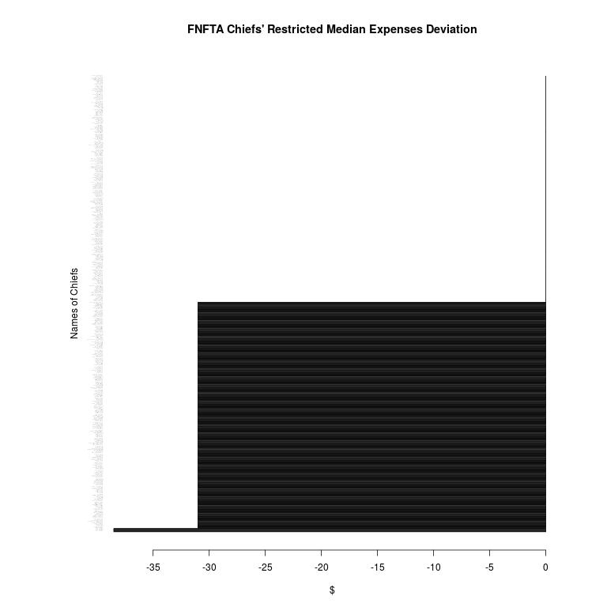
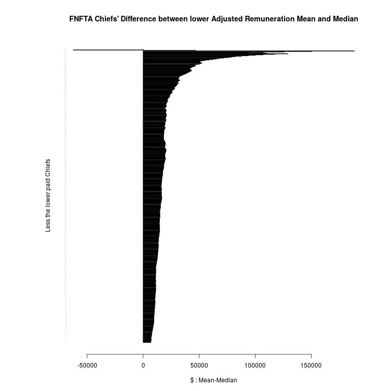
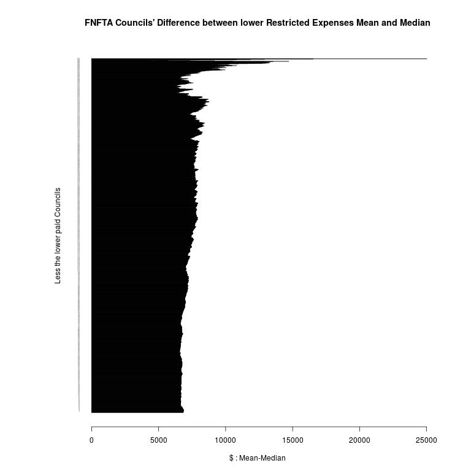
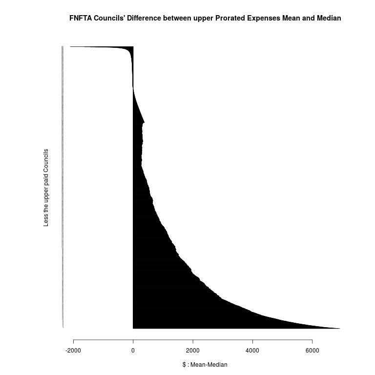

# Data Analysis

Let's get straight to the results as that is what everyone is interested in:

## Chiefs:

<table>
 <tr>
  <td>Chiefs</td>
  <td></td>
  <td>Number of</td>
  <td>Median</td>
  <td>Mean</td>
  <td>first zero</td>
  <td>zero Median</td>
  <td>zero Mean</td>
 </tr>
 <tr>
  <td>Remuneration</td>
  <td>restricted</td>
  <td>473</td>
  <td>$65,780</td>
  <td>$72,685</td>
  <td>29</td>
  <td>$64,420</td>
  <td>$64,446</td>
 </tr>
 <tr>
  <td></td>
  <td>prorated</td>
  <td>554</td>
  <td>$65,518</td>
  <td>$73,017</td>
  <td>42</td>
  <td>$64,031</td>
  <td>$64,104</td>
 </tr>
 <tr>
  <td></td>
  <td>adjusted</td>
  <td>554</td>
  <td>$66,054</td>
  <td>$72,841</td>
  <td>37</td>
  <td>$64,400</td>
  <td>$64,448</td>
 </tr>
 <tr>
  <td>Expenses</td>
  <td>restricted</td>
  <td>473</td>
  <td>$14,969</td>
  <td>$22,003</td>
  <td>338</td>
  <td>$3,995</td>
  <td>$4,003</td>
 </tr>
 <tr>
  <td></td>
  <td>prorated</td>
  <td>554</td>
  <td>$14,603</td>
  <td>$21,597</td>
  <td>512</td>
  <td>$2,489</td>
  <td>$2,497</td>
 </tr>
 <tr>
  <td></td>
  <td>adjusted</td>
  <td>554</td>
  <td>$14,757</td>
  <td>$21,693</td>
  <td>416</td>
  <td>$3,553</td>
  <td>$3,573</td>
 </tr>
</table>

How to read this table? Here goes:

As stated in the upperleft corner, this is the *Chiefs* statistics. It is split into "Remuneration" and "Expenses" statistics.
Each, for example *Remuneration*, has three interpretations of the cleaned and consolidated data that was generated from the
translation phase of this project. Each interpretation varies based on the problematic nature of time. If some chiefs did not
work the fully year (election year), how do you compare their salaries to obtain an average? ...for example. The problem and
need for interpretations arise specifically within the *Months* header from the consolidated data.

So the "restricted" version takes any Chiefs who did *not* work the full year and simply removes their data. We're interested
in "12 months" data, so anything else which isn't directly *comparable* is simply purged. These deletions inform the header
"Number of", which in this case says the statistics are based off of 473 chiefs (instead of the 559 in which the consolidated
data is based).

The "prorated" interpretation translates any Chief who didn't work the 12 months, and converts their remuneration and expenses
to what they would have made if they did work 12 months. It makes all the data comparable, though due to a few exceptions
the data is taken from 554 chiefs (instead of the 559).

The "adjusted" interpretation extends the prorated strategy, with the aim of fixing "double counting". The limitation of
the "prorated" interpretation is that for those Nations which did have election years and thus had more than one chief on
record, both chiefs remunerations and expenses would contribute to these statistics. The adjusted version algorithmically
takes the Chief who worked the longest for that year (even if it happened said chief was outgoing, the algorithm didn't
discern such details), and drops any other chief of that nation---this way at most one chief per nation is counted.
Finally, these adjusted chiefs remunerations and expenses are prorated, and the statistics are taken from this data.

With the interpretations outlined, I will talk briefly about the remaining columns. The "Median" and "Mean" are pretty
straightforward, but the "zero Median" and "zero Mean" need some explaining. The idea is, if you were to remove the top
paid chief, how would that effect the median and mean? Now if you kept removing top paid chiefs, how many would you need
to remove until the median and mean were effectively equal? This is signified by the "first zero" column, so for example
under the adjusted remuneration, you'd need to remove the first 37 top paid chiefs in order for the median and mean to
match (or nearly match). The "zero Median" and "zero Mean" then give the median and mean with the "first zero" number
of chiefs removed.

Finally, why would such a "first zero" analysis matter?

+ I will *emphasize* here I am not a polished statistician. I would consider myself a competent entry level statistician,
but part of this project is personal in that it allows me to explore and develop the necessary intuition to take my statistal
education and skill set further. 

The "first zero" analysis is intuitively relevant as I'm told the difference between *median* and *mean* can indicate or at
least hint at wealth distribution within a population (or society). If for example there is a large middle class economically
speaking, then far less of the population will be bottom and top earners, meaning their salaries will have less effect on the
mean. When this is the case, mean and median tend to be closer. If for example the middle class is small, or the top earners
make greatly disproportionate quantities relative to the middle class, then their salaries will skew the mean to be much higher
than the median.

In this case, the data---at least to me---suggests that 37 out of 554 (~ 7%) of Chiefs make disproportionate amounts relative
to other chiefs (such that they skew a difference between the median and mean). If this intuition is even appropriate, what does
one even do with it? Keep in mind chiefs' salaries are determined not in relation to each other, but in relation to their own
nations---and each nation as a self-determining society with its own contextual factors shapes that relationship, especially
its financial relationship.

As this is the case, I don't believe it's fair to compare chiefs' wealth with respect to each other
(they do not make up any societies that I know of), but rather it provides an indicator of the economic health of nations
themselves, and especially relative to each other. In this case, my own interpretation is that there is a spread of wealth
distribution across the First Nations.

> My own opinion is that if we are going to rise, we are best to do it together,
> and when possible (when it doesn't conflict with individual nations' sovereignty),
> that First Nations pull and pool resources and be each others' insurance.
> Share expertise, and help build each other up. One of First Nations' greatest
> strengths against colonial powers is the fact that they are *not* united,
> meaning the federal government has to deal with 500+ nations separately.
> Regardless, providing support networks that do not compromise this strength
> is easily possible, and it also means the federal government is less able
> to isolate, divide and conquer.

# Council:

The table structure for council is almost identical and does not need its own "how to read this" explanation with the exception
of the "average size" column: This column provides the average number of council members across nations (excluding chiefs).
So for example adjusted has about 6 (~ 5.58) councillors per nation, taken from 551 nations, means there's about 3075 councillors
total (rough estimates):

<table>
 <tr>
  <td>Council</td>
  <td></td>
  <td>Number of</td>
  <td>average size</td>
  <td>Median</td>
  <td>Mean</td>
  <td>first zero</td>
  <td>zero Median</td>
  <td>zero Mean</td>
 </tr>
 <tr>
  <td>Remuneration</td>
  <td>restricted</td>
  <td>533</td>
  <td>4.70</td>
  <td>$39,500</td>
  <td>$41,747</td>
  <td>55</td>
  <td>$38,678</td>
  <td>$38,679</td>
 </tr>
 <tr>
  <td></td>
  <td>prorated</td>
  <td>551</td>
  <td>6.39</td>
  <td>$39,000</td>
  <td>$43,516</td>
  <td>132</td>
  <td>$38,000</td>
  <td>$38,010</td>
 </tr>
 <tr>
  <td></td>
  <td>adjusted</td>
  <td>551</td>
  <td>5.58</td>
  <td>$39,150</td>
  <td>$42,412</td>
  <td>78</td>
  <td>$38,537</td>
  <td>$38,543</td>
 </tr>
 <tr>
  <td>Expenses</td>
  <td>restricted</td>
  <td>533</td>
  <td>4.70</td>
  <td>$6,062</td>
  <td>$12,883</td>
  <td>2233</td>
  <td>$0</td>
  <td>$0</td>
 </tr>
 <tr>
  <td></td>
  <td>prorated</td>
  <td>551</td>
  <td>6.39</td>
  <td>$5,944</td>
  <td>$12,960</td>
  <td>2986</td>
  <td>$0</td>
  <td>$0</td>
 </tr>
 <tr>
  <td></td>
  <td>adjusted</td>
  <td>551</td>
  <td>5.58</td>
  <td>$6,000</td>
  <td>$12,935</td>
  <td>2704</td>
  <td>$0</td>
  <td>$0</td>
 </tr>
</table>

## Accountants:

Within the data entry phase, having chosen to include the accounting firms associated with reviewing the remuneration and expenses
reports for each nation, I have also analyzed the distribution of First Nation accounts:

The names aren't apparent in the graphic, but the top ten firms are as follows:

<table>
 <tr>
  <td>accounting firm</td>
  <td>count</td>
 </tr>
 <tr>
  <td>MNP LLP</td>
  <td>92</td>
 </tr>
 <tr>
  <td>BDO Canada LLP</td>
  <td>55</td>
 </tr>
 <tr>
  <td>KPMG LLP</td>
  <td>33</td>
 </tr>
 <tr>
  <td>Collins Barrow LLP</td>
  <td>20</td>
 </tr>
 <tr>
  <td>Deloitte LLP</td>
  <td>20</td>
 </tr>
 <tr>
  <td>Crowe MacKay LLP</td>
  <td>18</td>
 </tr>
 <tr>
  <td>Holukoff Chiarella</td>
  <td>17</td>
 </tr>
 <tr>
  <td>Grant Thornton LLP</td>
  <td>15</td>
 </tr>
 <tr>
  <td>Chalupiak & Associates</td>
  <td>14</td>
 </tr>
 <tr>
  <td>Reid Hurst Nagy Inc.</td>
  <td>14</td>
 </tr>
</table>

Looking at the above graphic, it intuitively appears as if this distribution of firms follows a *power law distribution*.
I am not an expert in this area, but from what I know this type of distribution occurs within contexts which are self-regulated
and self-organize. The general pattern is the (here) firm with most accounts we call "f0". The firm with the second highest
number of accounts will be somewhere close to f0/2, while the firm with the third highest number of accounts will range around
f0/3, etc. Testing this out, our f0=92 (MNP LLP); while our f1=55 ~ 46=92/2; and our f2=33 ~ 30=92/3.

For the record, the above paragraph's analysis is not rigorous proof, but I'd hope you get the idea. In anycase, if this
distribution is in fact a power law version, it might imply the market for First Nations' accounts has self-organized---meaning
there has been no clear outside influence (putting to rest any conspiracy theories).

Even if this is the case, my own personal recommendation---unless someone else wiser points out its flaws and suggests something
better---is that First Nations themselves (instead of colonial government powers) *do* interfer artificially with this
distribution. Resource extraction is big business for Big Oil as well as Nation States (including foreign ones), and First
Nations hold many such resources within their lands: Corporate and government hacking is in full swing, and the more centralized
First Nations accounts and their private and sensitive information are, the easier it is for this information to leak.

I recommend something closer to a uniform distribution regarding the top firms, not to mention assurances such as access to
security audit reports, background checks, corporate influence/dependencies. Such things aren't necessarily easy to negotiate
as firms will try to protect themselves as well, but at the same time just trusting them carelessly and blindly isn't going to work
either.

With that said, although I myself from a security point-of-view suggest a uniform distribution, I also recognize the nature
of economics and market determined prices. Economies of scale would suggest the more accounts a firm has, the more specialized
and efficient they become at handling similar accounts, effectively lowering their own cost (of audit/review "production"),
and if the cost for them goes down, it's always possible to negotiate a lower price in a competitive market. As no firm seems
to have a clear monopoly, nor does it seem an oligopoly exists either, the market is closer to being competitive. Given this,
there is a trade-off, if the distribution is more uniform, security might be better, but cost goes up, whereas if the distribution
is competitive, security decreases but prices improve. Intuitive economics suggests there might be an equalibrium between security
and price. If you can figure that out, you have real hard data and a starting point for negotiating a stronger relationship with
the firms you do business with.

## Whitecap Dakota (Matters of Design):

http://www.cbc.ca/news/canada/saskatoon/new-homes-for-sale-on-whitecap-dakota-first-nation-s-land-1.2741206

## The analysis:

## Explorations:

+ r-chief\_xor\_council
+ r-restrict\_prorate\_adjust
+ generic-analysis
+ chief-analysis
+ council-analysis
+ accounting-analysis

### Intuition:
### Dependencies:
### Limitations:
### Recommendation:

r-chief\_xor\_council:

+ data\_structure-consolidated-15-03-06-0221.csv
+ skim\_chief\_xor\_council.r
+ chiefs\_grep.log
+ chiefs\_except.log
+ chiefs\_let.log
+ council\_grep.log
+ council\_except.log
+ council\_let.log
+ skim\_remainder.r
+ remainder.log
+ partition\_chief\_and\_council.r

### Intuition:
### Dependencies:
### Limitations:
### Recommendation:

r-restrict\_prorate\_adjust:

+ data\_structure-chiefs-15-03-06-0405.csv
+ data\_structure-council-15-03-06-0405.csv
+ restrict.r
+ prorate.r
+ adjust.r

### Intuition:
### Dependencies:
### Limitations:
### Recommendation:

generic-analysis:

generic.r

### Intuition:
### Dependencies:
### Limitations:
### Recommendation:

chief-analysis:

+ data\_structure-restricted-chiefs.csv
+ data\_structure-prorated-chiefs.csv
+ data\_structure-adjusted-chiefs.csv
+ source.r
+ analyze
+ stats.log

### Intuition:
### Dependencies:
### Limitations:
### Recommendation:

council-analysis:

+ data\_structure-restricted-council.csv
+ data\_structure-prorated-council.csv
+ data\_structure-adjusted-council.csv
+ source.r
+ analyze
+ stats.log

### Intuition:
### Dependencies:
### Limitations:
### Recommendation:

accounting-analysis:

data\_structure-consolidated-15-03-06-0221.csv
source.r
analyze
top\_ten\_firms.log

### Intuition:
### Dependencies:
### Limitations:
### Recommendation:

## Conclusion:

The more I look at how much non-council financial information is required to be posted, the more I think the intent
is for the feds to use this information to size up their opponent: Legal battle with a First Nation? Legal and political
strategy is determined by knowing how much infrastructure and resources they have; what connections (networks, social support)
they have to obtain additional funding for their legal battles, etc.

Like the NSA "it's just metadata" argument, you can determine a surprising amount with even this "meta" information
(and it's not even that meta).

