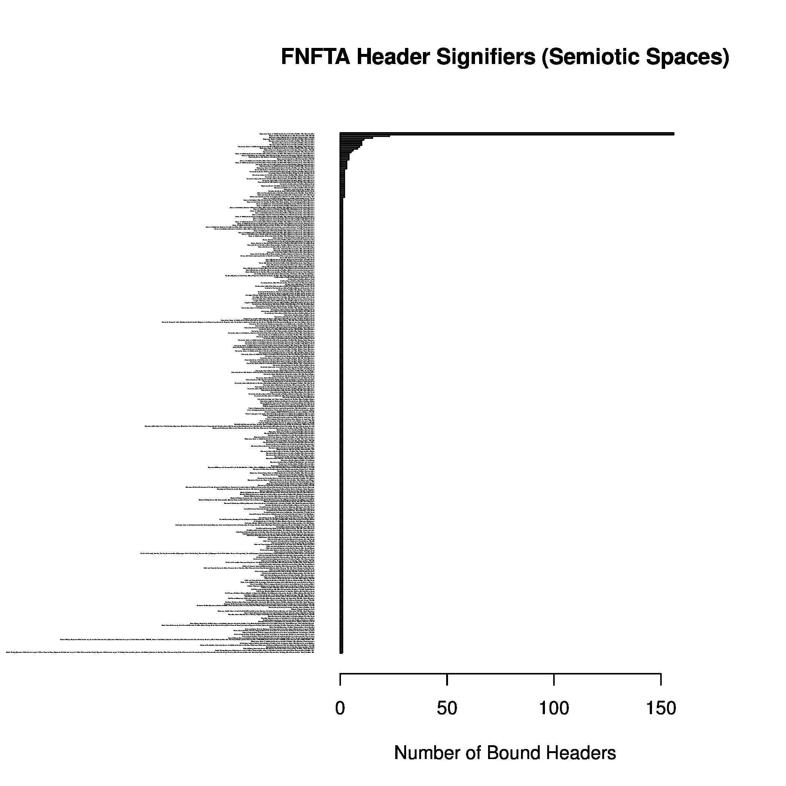
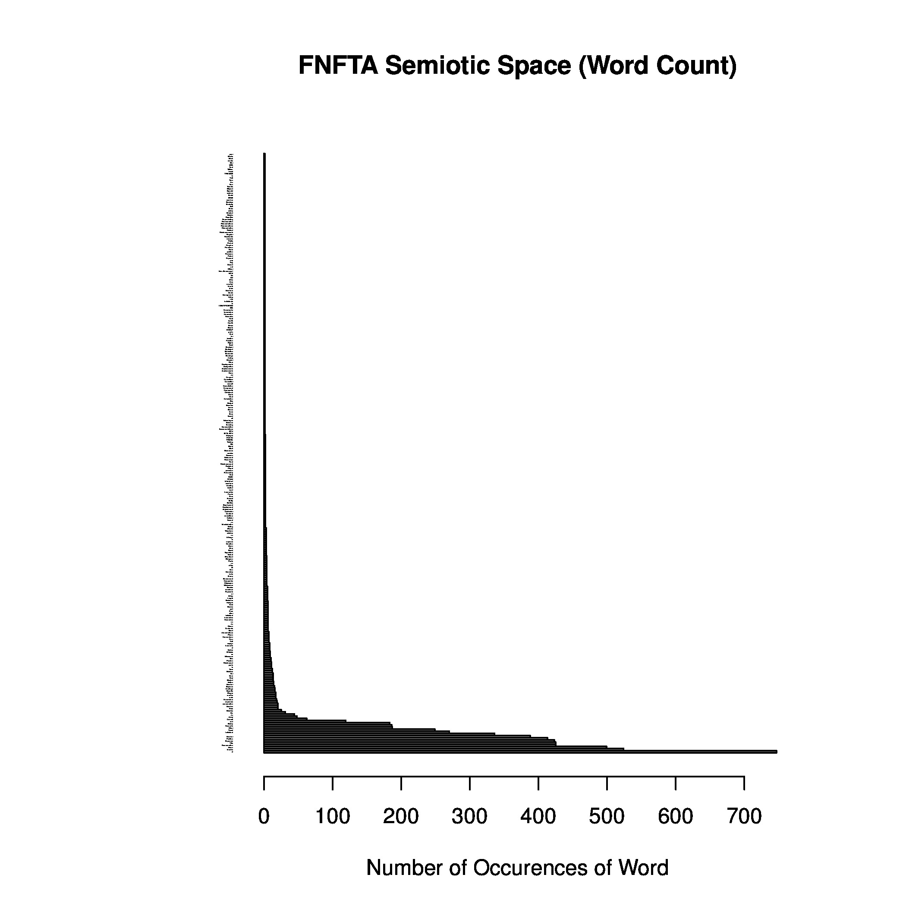

# Translation

This phase is broken down into four main parts:

1. Validation.
2. Semiotic Analysis.
3. Normalization.
4. Consolidation (factorization).

## Validation:

This part consists of validating the structural specification of the data entry csv file:

+ data\_structure.csv

#### Intuition:

Before any structural analysis or translation can begin, we have to check our assumptions:
Whatever scripts we write to translate the data entry text file into a well formatted csv file
requires assuming certain characteristics about the data entry file, and so we must verify those first.

In particular, I had two varieties of scripts, a "differator" (I make up words that I probably shouldn't),
and several validators, all within the "diagnostics" folder:

diagnostics/differators:

+ report\_differator

Here I simply compared the existing pdf files with the entry designation numbers in the data entry csv file to see if
I was missing anything. As the FNFTA pdfs are slowly released one by one over time on the government website, I would
need a reminder of what had changed whenever I returned to this part of the project.

diagnostics/validators:

+ space\_validator
+ entry\_line\_validator
+ first\_line\_validator
+ comma\_dimension\_validator
+ unique\_entries\_validator
+ count\_validator

All the validators read in the data entry csv file. The "space" validator simply made sure each entry was seperated by no more
than one empty line. The "entry line" validator looked at each entry line and made sure it conformed to a regular structure,
notably that each entry ended with a comma (except the final entry of the line) and that each entry was seperated by one or more
tabs (no other whitespace was allowed). Next, the "first line" of an entry being a little different, was additionally independently
validated. The "comma dimension" validator made sure that the number of commas (and thus entry lines of a single entry) matched.
If they didn't match (not including the first line), it would be an indicator of an entry error. The "unique entries" validator
made sure I didn't enter the same data more than once, or rather I didn't mistakenly assign two different entries with the same
designation number. Finally, the "count" validator gave the total count of current entries (to compare with the number of pdf reports)
to make sure I wasn't missing anything. It's a bit redundant with the differator script, but it doesn't hurt to be thorough.

#### Dependencies:

+ mawk (version of awk text editing programming language)
+ sort (commandline string sorter)
+ diff (compares two files to show where they differ)

#### Limitations:

Script bugs, or just plain wrong coding.

#### Recommendation:

A code audit. The greater number of eyes viewing the code, the more likely it is we find and patch bugs or see code that has no
bugs but doesn't actually do what it's intended. Or even a case where there's just a better way to write the code.

## Semiotic Analysis:

This part consists of analyzing the semiotic space of the header content. It itself is actually broken into two main parts:

1. Bound header analysis.
2. All header analysis.

Conceptually, one has a list of headers for each pdf-report-as-entry, and that list of headers which belong together are
referred to as *bound headers*. On the other hand, each individual header regardless of which entry it belongs is the collection
of *all headers*.

Though broken into parts, the main intuition for a semiotic analysis is that the *headerspace* for the various pdf entries are not
normalized.  Different Nations use different headers, which makes unifying all Nations' data into a single well-formed csv table
problematic. The semiotic analysis looks at the natural orders within the existing headerspace as way forward to solving this
normalization problem.

### Bound header analysis:

Here I compare bound headers looking for patterns with which to orient a standardized header subspace---allowing for an end goal
in translating the remaining headers and thus normalizing them.

#### Intuition:

Though far from a thorough/proper solution, one relatively simple approach is to look at the distribution of each list of bound
headers. I have written two simple scripts for this purpose:

+ pull\_bound\_headers
+ csv\_bound\_headers

The first, "pull\_bound\_headers" pulls the bound headers from the data entry file, sorts them, and removes duplicates. The
resulting file is informal in the analysis, as no scripts directly depend on it later on, but it is useful to scan, skim,
and gauge the bound header space before moving on---to get an intuitive feel for it, so that the human might pick up something
useful or find an error the machine would not predict.

The second, "csv\_bound\_headers" pulls the bound header list as well, but here it counts them and stores this in a temporary file.
It then calls:

+ source.r

and creates a jpg image of the distribution. With the current version of the data table, the following graphic is the result:

As you can see, the actual header text is too small to read, but the graphic gives a good visual showing that one bound header list
stands out far more than all the others and is easily the candidate for translating the header space. The R script "source.r" also
provides the actual details as well:

	tail(t[ordered,])
	Expenses, Name, Number_of_Months, Position, Remuneration				 10
	Expenses, Name, Number_of_Months, Position_Title, Remuneration                           10
	Expenses, Name_of_Individual, Number_of_Months, Position, Remuneration                   11
	Expenses, Name_NA, Number_of_Months, Remuneration, Title_NA                              15
	Expenses_NA, Months_NA, Name_NA, Remuneration_NA, Title_NA                               23
	Expenses, Name_of_Individual, Number_of_Months, Position_Title, Remuneration             156

Notably, and I observed this intuitively myself manually entering the data, but the follower headerspace with 156 pdfs matching
it is the clear winner (in its natural order within the pdf reports):

	Name_of_Individual, Position_Title, Number_of_Months, Remuneration, Expenses

#### Dependencies:

+ mawk (version of awk text editing programming language)
+ sort (commandline string sorter)
+ R (statistically oriented programming language; well suited for statistical graphics)
+ convert (part of the ImageMagick toolset)

#### Limitations:

As always, code verification (bug finding, semantic verification). More notably, given the exact nature of this analysis,
the distribution is the biggest limit here. It does not provide a universal solution regarding general contexts.  It just
happens the well behaved nature of this given context allows for this simple heuristic approach of distribution analysis to pass.

In the broader solution, one would actually need to look at the branches of math called *partition theory* and *lattice theory*.
Such analyses would look at every possible header subspace and the non-linearly ordered lattice of *chains* to determine
maximal/optimal solutions. In this general case a unique solution is out of the question, and choosing from the collection of
maximal solutions is a matter of the politics of interpretation.

Finally it's worth noting with the full out partition theory analysis, looking only at the combinatorics of it, it is easy to see
the computational power required for exact solutions is in fact impractical.  Think of it this way: The headerspace we've decided
upon above is just one possible subset of the whole and existing headspace.  Once chosen, such a subset is now a constraint upon
which to partition the remainder of the headerspace (the chosen subset's compliment); each header would be assigned one of the
representative groups defined by the chosen subset. How many such combinations are there? A lot. The number of ways to partition
a set grows exponentially (greater than that actually) and for each given partition, the number of ways to partition the remainder
into 'k' subsets is family of numbers called the Stirling numbers of the second kind, and they grow pretty much just as rapidly.
One could simplify a little by constraining (filtering) combinations by chains as well as by known linguistic constraints of a given
language, but there's no consistent approach there for general contexts and the numbers we're looking at are still ridiculously large:
Many given constraints would still leave far too many solutions for a human to manually look through. At the end of the
day, heuristic solutions would still be required.

#### Recommendation:

The landscape of the strategy space for analyzing semiotics spaces is outlined in the above limitations. As a heuristic approach
regardless of style is generally required, I would recommend not taking this subphase lightly.

Beyond that, when one looks at the actual scripts written, there is much room for optimizations---especially factorizations of
code. This is expected as most code presented here is more prototypical in nature.

### All header analysis:

Here I perform a relatively simple cluster analysis of the individual headers, grouping them together by semantic equivalence.

#### Intuition:

With the headerspace decided upon in the bound header analysis, we know what headers we want all the others to translate to.
The simplest strategy would be to go over the list of all headers, and decide which one from our *terminal* headerspace the given
*initial* header would translate as. What's more, in preparation for a unified csv table with all existing headers, we need to define
defaults as none of the pdf reports will contain all existing headers---if a report provides no values for a given header, we will
need to know to default it as '0' or as 'NA' depending on the type of content that header represents.

Any given analysis and preparation is inevitably doing these, but again going back to the philosophy of do-as-little-work-as-possible
the main goal of this part of the analysis is to reduce human manual labour. This particular analysis has many parts in fact,
so I will break down and explain:

The first part within the "all\_headers" folder is the script:

+ pull\_all\_headers

which pulls all headers (unbound) and stores them with repetition in the "word\_count\_R" folder:

+ all\_headers.log
+ csv\_word\_count
+ source.r
+ word\_count.jpg
+ ordered\_words.log

Here we invoke the "csv\_word\_count" script which counts the number of each header, calls "source.r" and produces the "word\_count.jpg":

as well as the "ordered\_words.log" file. Though a minor detour from the main effort, these "ordered words" are useful in the following.
With that said, the "pull\_all\_headers" script also pulls all headers, sorts and stores them uniquely in the "decompose\_headers" folder:

+ unique\_headers.log
+ gauge
+ partition
+ headers.log
+ create\_clusters
+ ordered\_words-15-02-16-0310.log
+ clusters
+ pull\_map
+ pulled\_map.log
+ folded\_map-15-02-16-0310.log
+ pull\_defaults
+ pulled\_defaults.log
+ folded\_default-15-02-16-0310.log
+ unfold\_maps
+ factor\_map.log
+ default\_map.log

The file "unique\_headers.log" contains all headers without any repetition as the starting point.
It is tested with the "gauge" script which not only sifts out words considered *similar* to the input word,
it does it for a range (from 50%-100% similarity [based on the metric]) returning the words sifted.

One manually looks at which percentage as input is preferred: This is necessary as the metric for similarity is syntactic
in measure, not semantic---it will pull syntactically similar words, which as a strategy still saves a lot of time and effort,
but does require some manual effort in choosing which percentage to go by (so as to maximize sifting words of interest but not
sifting semantically unrelated words). If you're familar with machine learning, it's at least intuitively similar to determing
the learning rate: It gauges the number of words sifted returning both the words and the numbers; it does this for
a range of parameters from 50%-100%. One then goes through those filters and chooses which one by percent.

---------------

I should give a brief explanation on the metric used, as it was hand-coded by myself, and although I do have the code open sourced
up on GitHub, I don't yet have documentation up explaining how it works.

The metric is called "longest positional match", and it takes two words, and shifts them against each other in all possible ways
to see which positional shift provides the greatest number of positional matching. For example the words:

	tuesday
	wednesday

in their current positions don't match anywhere, but if you shift the word "tuesday" 2 spots over to the right you have:

	__tuesday
	wednesday

and all of a sudden you have 5 positional matches. So the longest positional match takes two words as input, and returns
four values: number of matches; entropy; number of non-matches of the first word; number of non-matches of the second word.
The number of matches is straightforward and is a proper metric. As it is possible one can shift in more than one way (or
a different number of positions) and still get a longest match, the *entropy* value provides how many such matches exist.
Intuitively the higher the entropy, the more redundant the words are (self-similar), and so that factors in. The final
two values are provided for convenience and could otherwise be calculated from the first value and the lengths of the words.

---------------

Using this information we destructively "partition" the "headers.log" file keeping unrelated words within "headers.log" and moving
related words into the "clusters" directory within their own file.  The choices made in specifying partition have been stored as
a script in "create\_clusters" for transparency. As well, in order to help determine which words to gauge, "ordered\_words.log"
(with a timestamp indicating it may change in the future) is provided as reference. The "clusters" directory grows each time
while "headers.log" shrinks in terms of effect.

The script "pull\_map" creates "pulled\_map.log" which takes the remaining words in "headers.log" and adds back
the "class representatives" (implemented as the filenames) within the "clusters" directory.
At this point pulled\_map.log is manually edited to define the core mapping and is saved under the name: "folded\_map.log"
(with a timestamp indicating here it was manually edited).

+ Note: some of the terminal headers within "folded\_map.log" end in an asterisk '\*' meaning there wasn't absolute certainty
on my part that the interpretation of what should be mapped was correct. Keep in mind any code which interacts with this record
ignores these asterisks---it's more of a comment for human transparency and scrutiny.

At this point, we're ready to prepare the defaults. The best way to reduce workload on this and to automate it is to realize
that we will take a given header and translate it into the terminal headerspace---which has only five headers---and to manually
determine the defaults for those five. All initial headers, to determine their defaults, simply check which terminal header
they map to and what default is associated with that: It'll be the same. As such, we pull the terminal headers with "pull\_defaults"
and save them as "pulled\_defaults". This file is manually edited and saved as "folded\_defaults.log" (with a timestamp indicating
here it was manually edited).

The script "unfold\_maps" automates the process of reexpanding the folded maps into their respective
"factor\_map.log" and "default\_map.log". These respective files "factor\_map.log" and "default\_map.log" are what we're interesting
in transferring to the next subphase of our larger analysis.

#### Dependencies:

+ mawk (version of awk text editing programming language)
+ sort (commandline string sorter)
+ R (statistically oriented programming language; well suited for statistical graphics)
+ convert (part of the ImageMagick toolset)
+ longest\_positional\_match (word comparison metric)

#### Limitations:

Code verification in this stage is probably the heaviest. Ancient programs such as "mawk" and even "R" have been thoroughly debugged,
so there's no issue there, but the scripts I wrote should still be semantically verified. What's more, the "longest positional match"
code I used I crafted myself. I have recently started my own personal [C++ template code library](https://github.com/Daniel-Nikpayuk/nik),
which will be gradually expanded, extended, and improved upon, but it is likely the weakest link in any chain of error that exists
within this subphase.

Beyond this, there is an interoperability issue. There are many different languages of code working together, and so code maintainence
is a bit more of an issue, not to mention modularization issues.

Other than that, the manual human mapping choices. The strength of this style is they are documented for transparency
and can be held up to scrutiny, but it's also important to verify they mappings were done as intended.

#### Recommendation:

Factorization of code. As there are several different languages, it would be preferred to reduce this. In the long run I myself intend
to further my C++ template library and rewrite much or most of the needed code in this single language---within reason of course,
I don't know if I'll have the time to be able to tackle a graphics library to produce quality statistical graphics the way R does,
for example.

## Normalization:

In this subphase we create a unified csv file by translating the raw data entry file and normalizing the headerspace.

#### Intuition:

Though the idea has been explained previously, I will again explain here: The data entry table will be translated so
each report entry will match up in using all existing headers (from it and every other pdf report). As such, each
entry will have excess headers, which will default to a predetermined default value. At the end of this
*least common multiple* translation of structure, we will have a raw and unified comma seperated value text file.

This is accomplished with the files in the "translate\_table" folder:

+ data\_structure-entry-15-03-03-0008.csv
+ default\_map.log
+ translate\_table.h
+ main.cpp
+ COPYING

The "data\_structure-entry[...].csv" file is carried over from the data entry phase. The "default\_map.log" file is
carried over from the previous subphase. What's new are the "translate\_table.h" and "main.cpp" C++ files. When compiled
for the command line, this binary takes the following grammatical form:

+ translate\_table \[INPUT FILE\] \[OUTPUT FILE\] \[DEFAULT MAP FILE\]

the "data\_structure-entry[...].csv" file specified as the input file, a "data\_structure-raw[...].csv" file specified
as the output file, and the "default\_map.log" specified as the default map file. Note here that the output file with
all its redundancy (and default values) ends up being about 4.9MB. As such I have not included a copy of it in the
"translate\_table" folder as there will be a copy in a folder mentioned in the next subphase.

I'm not going to detail the C++ code here as I intend to fold it properly into my personal "nik" library. I intend to
create a "filer" class somewhat similar to the *awk* programming language. Why reinvent the wheel? Because sometimes
one needs to do some heavy text processing in which awk is missing one or two key components. At that point it's necesary
to break away with one's own code. Though that is neither here nor there regarding this project.

1. Personal note: The C++ code was hacked together in a hurry, as I didn't want to spend another month of my weekends to
properly clean up the design. It's ugly code, and not representative of my abilities, but it's functional---it got the
job done for this project.

Finally is the "COPYING" file which is the standard GNU open source license.

#### Dependencies:

+ g++ (part of the open source GNU compiler collection)
+ nik (part of my personal C++ template library)

#### Limitations:

As always: Code semantic verification; finding bugs. This is especially true as the code is custom crafted from my library
which is in its early stages. It is also hosted here on my GitHub account:

https://github.com/Daniel-Nikpayuk/nik

Next would be interoperability again: In this case, if you do bother to read the C++ code, you might wonder why I've resorted
data which was already sorted. I found this out the hard way, but the sort binary used on the linux commandline sorts the
"comment" character '#' differently: possibly because bash reads it as a comment and ignores that character? I don't know.
As such, I could not rely on an outside sorter and used my own. This is a good example of modularity and interoperability of
code.

#### Recommendation:

Factorization of code. The greater the dependency on frameworks made without regard to each other increases the likelihood
of interoperability issues. The biggest issue is when developers and api coders largely consider modularity of design,
but overlook the subtle semantic bugs like the sorting one mentioned above. In such cases you have the illusion of
interoperability making such bugs that much more difficult to find. Sticking to as few frameworks as possible potentially
reduces this---with the tradeoff of course of greatly increasing development time unfortunately.

## Consolidation (factorization):

This subphase takes the raw header table from the previous subphase, and with the terminal headerspace in mind translates
(factorizes) all other headers into and condensed, consolidated csv file.

#### Intuition:

For as much automation as there is in this section, it was also heavily human oriented. There are four notable parts
within the "map\_table" folder:

+ restructure\_map
+ verify\_map
+ clean\_raw
+ consolidate

We begin by taking the "factor\_map.log" from the semiotic analysis subphase, and do our due diligence on it, going through
each report and making sure our header translations are appropriate not just as general patterns, but in regards to actual
context (the pdf reports). For this, the "restructure\_map" part takes that factor map and reorganizes it to be much more
user-friendly and human readable for verification purposes. The "verify\_map" is obviously the part where we do this verification.

Once these parts are done, before we can actually factorize our raw table, we need to go over the entries themselves and make
sure they follow the translative assumptions. This will be our "clean\_raw" part, and finally we will be able to translate
in the "consolidate" part.

### Restructuring the factor map for user-friendly human verification:

Within the "map\_table/restructure\_map" subfolder:

+ map\_table.h
+ main.cpp
+ data\_structure-entry-15-03-03-0008.csv
+ factor\_map.log
+ factor\_map.csv
+ COPYING

The "map\_table.h" and its "main.cpp" compile a binary which takes the "data\_structure-entry.csv" (with timestamp) as well as
the "factor\_map.log" as input and returns the "factor\_map.csv" as output. In particular, the data structure headers are read,
are then repositioned to form a column of text (instead of a row), and the appropriate header mappings based off the factor map
are added as a second column. A leftmost column is also added with the First Nation designation number as its entries for record
keeping purposes. Finally, although not absolutely necessary, each entry is separated by a line space for human friendly reading.

### Verifying the factor map:

With a more human friendly rendition, one makes a timestamped copy of the "factor\_map.csv" and works on it within
the "map\_table/verify\_map" folder:

+ factor\_map-15-03-03-0210.csv
+ pull\_terminal\_headers
+ terminal\_headers.log
+ make\_header\_map

Here, "pull\_terminal\_headers" is a script used as a sanity check: It pulls the terminal headers and returns only unique values,
double checking the manual entry for basic errors.

As with the creation of the "folded\_map.log" in *All headers* analysis, some of the terminal headers within "factor\_map.csv"
end in an asterisk '\*' meaning even after the contextual pdf verification, there still wasn't absolute certainty on my part that
the interpretation of what should be mapped was correct.

+ Note: I overused this asterisk convention, many translations I was fairly confident about, but I decided to play it safe---if any
doubt whatsoever I tended to add the asterisk. Once again, keep in mind any code which interacts with this record ignores these
asterisks---it's more of a comment for human transparency and scrutiny.
+ Note: As well, if you take a look at the "terminal\_headers.log" generated by the "pull\_terminal\_headers" script, you'll notice
a "Drop" header, which is another informal convention. There were a few exceptions of headers where they did not properly translate,
nor could they be cleaned for the final consolidation. In such cases I have labelled them as "Drop" with the understanding that in
the consolidation phase, when encountered, they will simply be dropped and not added to the final consolidated csv file.

Lastly, the "make\_header\_map" script simply removed the human readable line spaces from the factor map, thus converting it properly
into a comma separated value file---this being important as the consolidation assumes and makes use of the csv file generated by this.

### Cleaning and converting the raw data table:

Within the "map\_table/clean\_raw" folder:

+ default\_map.log
+ data\_structure-raw-15-03-03-0009.csv
+ pull\_bad\_cols.r
+ pull\_bad\_cols
+ bad\_cols.log
+ clean\_raw.r

The "default\_map.log" is the one generated from the All headers analysis. The initial work done is within the "pull\_bad\_cols.r"
R script, and the "pull\_bad\cols" (without the ".r" extension) is a bash wrapper script to simplify and redirect its output.
The "data\_structure-raw.csv" (with timestamp) is read in along with the "default\_map.log". Columns considered "bad" are numerical
columns which have 'NA' values. The algorithm checks the default map (default will tell us whether it is numerical by defaulting
to '0', or not, by defaulting to 'NA'). So first we find which columns are numerical by default, properly convert them to numerical
values (initially when read in they're assumed to be character strings), and then check if any of them exist as 'NA' values.
For those columns with 'NA' values, a sorted simplified version of the entries of that column are returned; simplified by removing
redundancy and only returning unique values once (otherwise the column would be too long and tedious for human eyes to glean error patterns).
These bad columns are saved as "bad\_cols.log".

Once the nature of "bad" is determined and for which columns, the "clean\_raw.r" R script catalogues and cleans those columns.
If you look at the code as a programmer, you'll notice its inefficiency, but I chose to write it this way because it provides
human readable (semi) transparent documentation which can be held up to scrutiny.

### Consolidating the cleaned raw data table:

Within the "map\_table/consolidate" folder:

+ data\_structure-header\_map.log
+ data\_structure-cleaned\_raw-15-03-03-0315.csv
+ source.r

From the "verify\_map" part earlier, we have the "data\_structure-header\_map.log" file (derived and verified from the "factor\_map.csv"
file). We have the "data\_structure-cleaned\_raw.csv" (with timestamp) from the previous part. Our "source.r" R script takes the cleaned
data structure, uses the header map to map each column header, and accumulate it into a condensed data structure.
This final consolidated structure is the starting point for the statistical analysis within the next phase.

#### Dependencies:

+ g++ (part of the open source GNU compiler collection)
+ nik (part of my personal C++ template library)
+ R (statistically oriented programming language; well suited for statistical graphics)

#### Limitations:

This subphase has the biggest limitations within this whole analysis and is the weakest link.

### Technical:

For starters, the "map\_table.h" and "main.cpp" are very similar to the "translate\_table.h" and its respective "main.cpp"
in the Normalization subphase. The reason for this again is the use of custom code. In the long run, as I've mentioned before,
I plan on further refining my personal "nik" library and will be able to rewrite and greatly simplify and factor out the
redundancy and uneven/unbalanced modular forms---the code will better mitigate complexity.

I will also point out that I am a relative beginner to the R programming language itself. If you look at the "source.r" of the
consolidate subphase, as an R coder this might be obvious to you. If there's a better way to work this code, feel free to share.
It gets the job done, but I'm fairly certain there's a more elegant more efficient way.

### Semantic/Political:

First is a human limitation.

During the data entry phase, I encountered numbers in parentheses such as "(160)" as entries.  As a non-accountant, I didn't know
what to do with these. For starters, going back to the design choices to modularize the data entry and translation phases, I again
made this choice to make documentation and interpretation more accountable.  I did my best to "leave the crime scene undisturbed"
so to speak. With this design policy, I also did my best to leave entries such "(160)" the way they were, but in my haste or moments
of reduced stamina I may have removed a few such parentheses.

Secondly, again with the parenthesized numbers, regarding interpretation---as I said I am a non-accountant---I looked around online
and best I can tell this is a convention of subtraction. This is how I interpeted it, but it's possible my interpretation is wrong.
This again is why I tried to be so thorough regarding documenting my own process. With that said, to be fair, in certain
contexts---when it comes to statistical averages that is---such numbers are quite small and don't actually change metric
output that much.

Another point is the detail of finance chosen at the First Nations' administrative level. Many if not most remuneration and expense
reports gave lump sums in terms of their remunerations and their expenses. If for example activists, journalists, politicians,
policy makers, think tanks, etc. use these numbers, they do not distinguish council and non-council varieties of finance. If for
example someone is interested in Council's median salary in terms of what they're paid for their role as Council, the median
provided here will be skewed to be higher than the numbers this person seeks.

The likely biggest issue with this analysis is with column headers such as "Other", "Other Remuneration", etc. When I translated
these, I got a feel for the overall meaning, and I interpreted such headers to default as "Remuneration". Having the practical
experience though of actually looking through these pdf reports, I'm fairly certain many of them were intended as "Expenses".
As such, this will factor in to any final statistic and will again skew it to be a bit high.

#### Recommendation:

Auditing of the technical code, especially the custom code done by me.

I would like to point out here, one of the major intents of this project was never to get perfect statistics. I acknowledge
due to insufficient interpretation at the translation stage, the final numbers will be skewed a bit high. For those interested
in better accuracy; it is easy enough to *branch off* from this point, go through the audited financial statements for each
nation and refine the interpetation of headers such as "Other". This is also an aim of open sourcing this project, and
part of the open source philosophy.

## Conclusion:

I chose to create a seperate "translation" phase even though it greatly extended the workload as part of the modular design
of the entire project. Even now, knowing this, I have no regrets and feel it is a best practice. I've touched upon this
in the documentation above, but will reiterate it here:

The first reason being transparency. As a first time project, there is great room for refinement, optimization of both the
methods and the data, but at least what was done was documented. Anyone can take the work here, and at any point branch off
to do their own analysis. The code is open, and I recognize not everyone has the technical background to read this digital
literature, but at least the methods have been explained (hopefully) in approachable terms, and in particular the highest
point of debate---the *interpretation* of headers---is in a simple text readable form, which anyone can read, regardless
of technical knowledge.

Secondly is life-span and reusability. If I did my job as engineer/designer, the workload is fairly well modularized and
the modules themselves are fairly well balanced against each other. If I've set up the "media space" of this design well,
the modular design has room to grow (extension, scale). If the modules are well partitioned and don't interfer with each
other, they can also be optimized. As parts can untangle, parts of the code or ideas can be reused in other projects.
I can't mathematically prove I've done any of this, but that was the intent, and hopefully I've done well enough.

